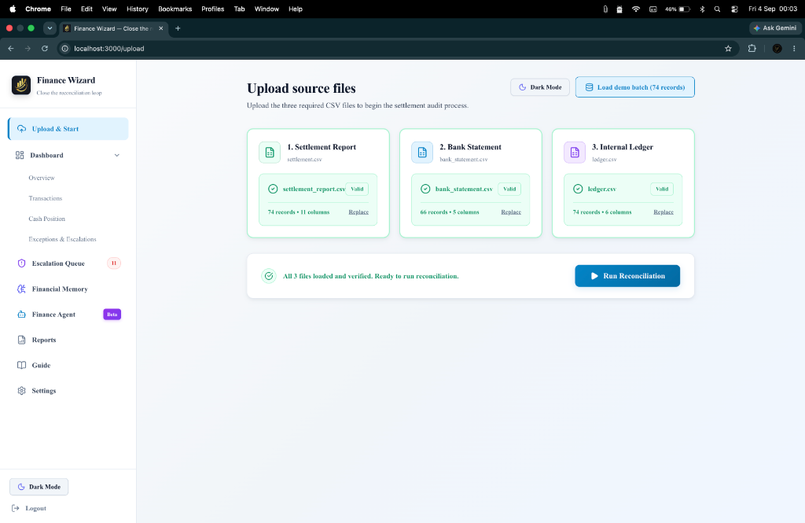
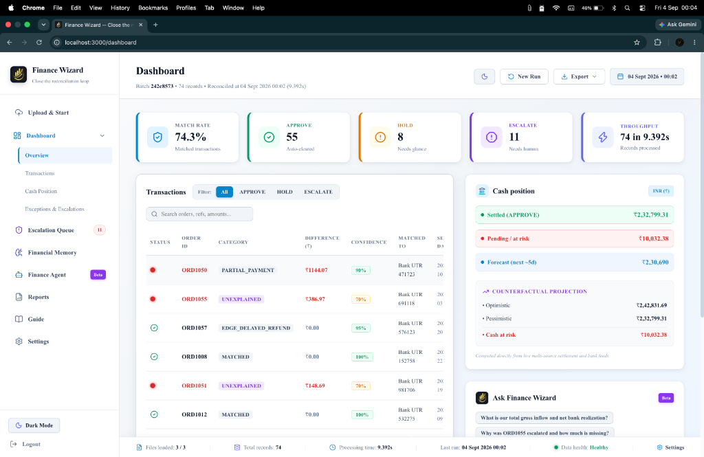
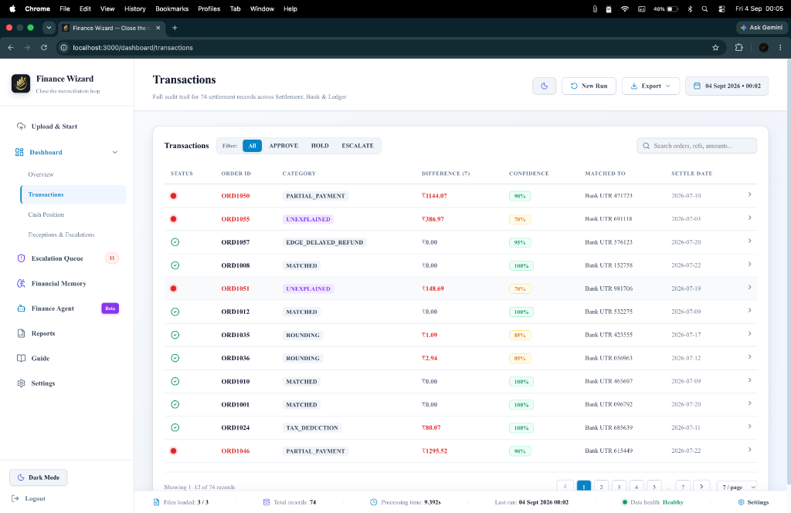
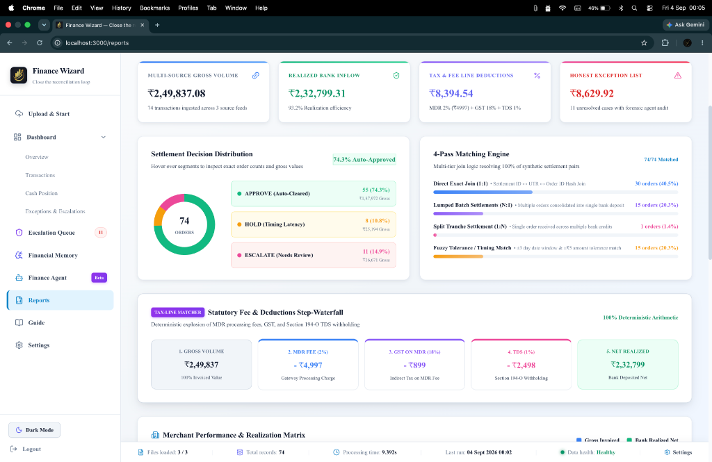
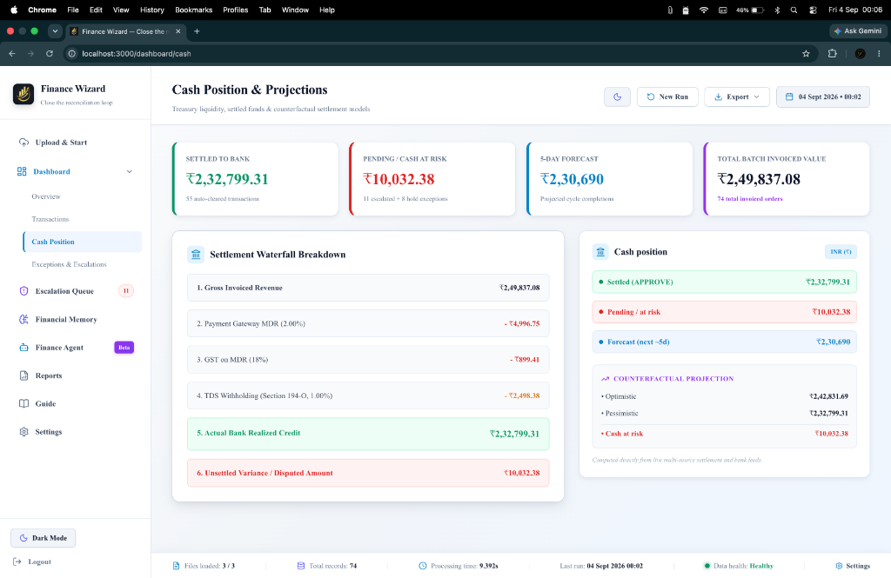
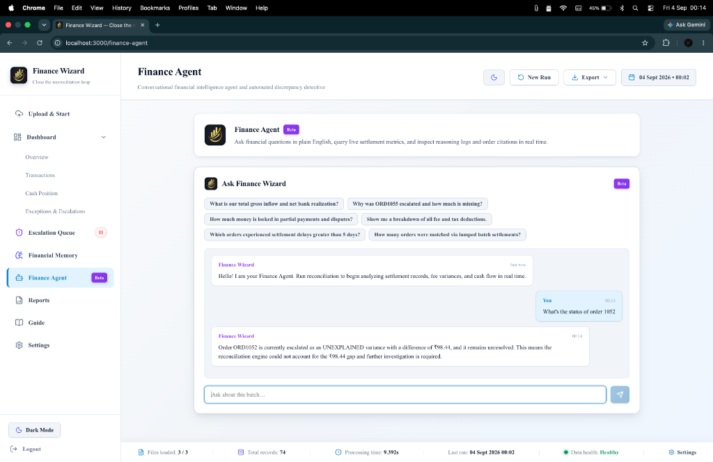
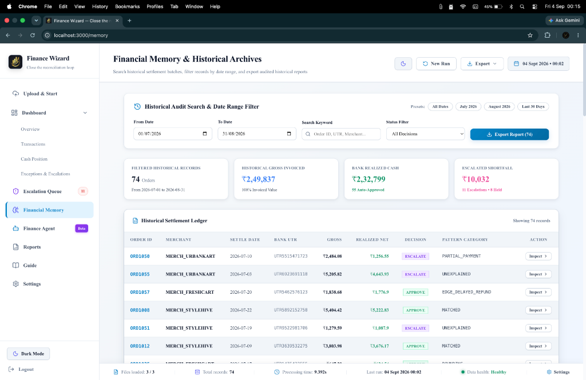
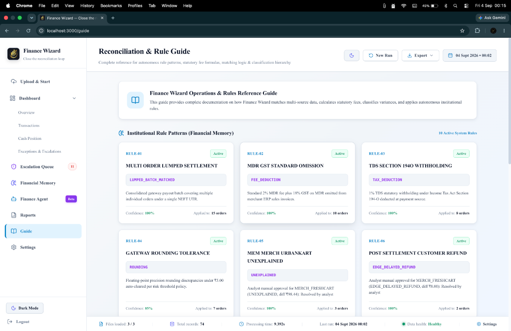
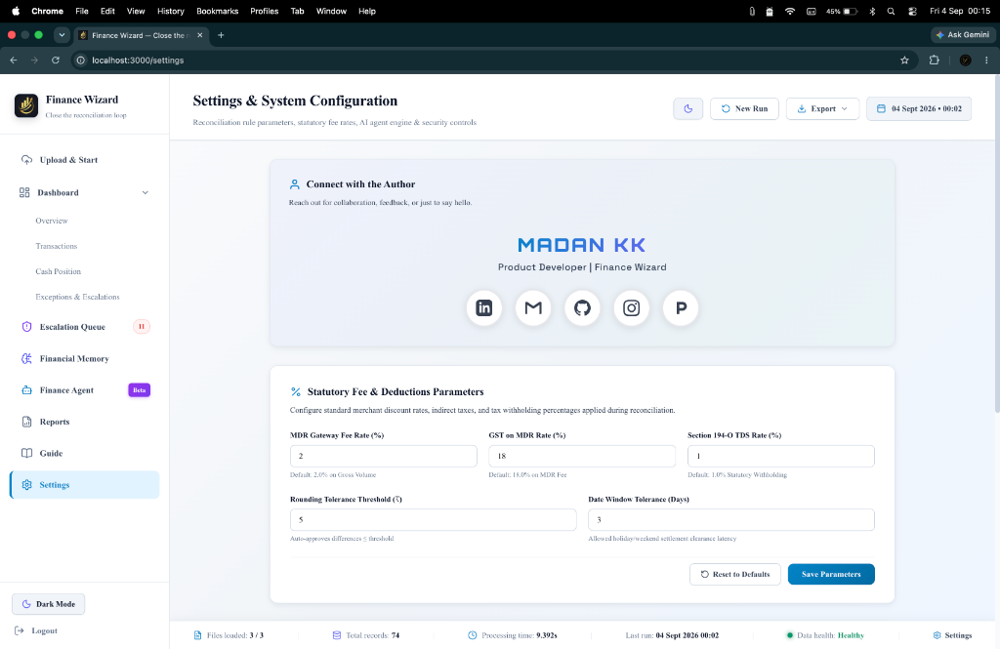
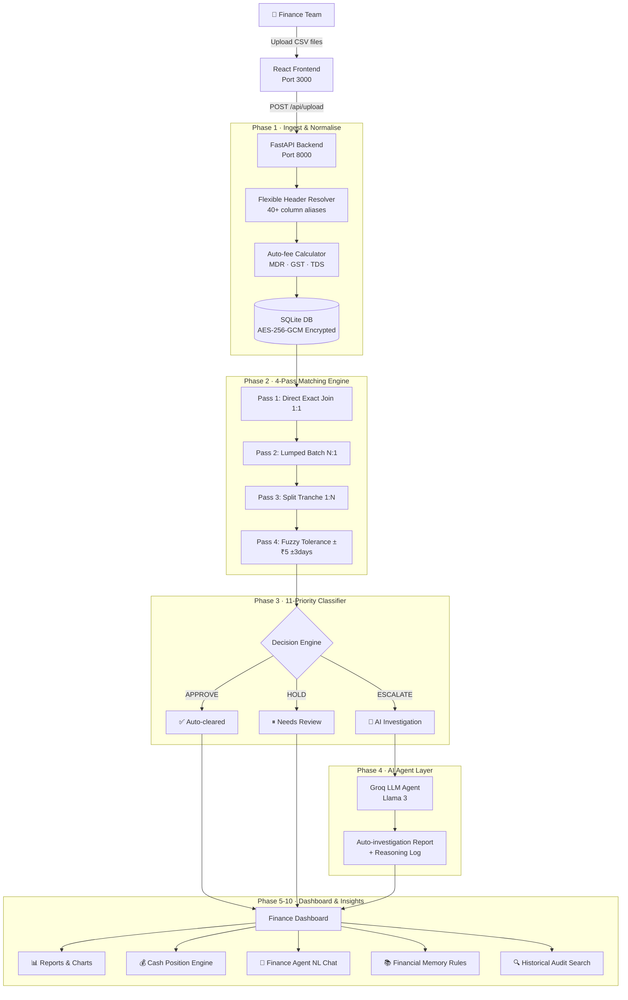

# 🧾 Finance Wizard — AI Finance Controller

<div align="center">

**Razorpay AI Buildathon · Track 04 — AI Finance Controller**

[](https://fastapi.tiangolo.com)
[](https://react.dev)
[](https://python.org)
[](https://vitejs.dev)
[](https://sqlite.org)
[](https://groq.com)

> **Transform 2–5 days of manual reconciliation into a sub-30 minute automated audit cycle.**

[🎬 YouTube Demo](https://youtu.be/XnVxCykOP3M) · [📸 Screenshots](#-screenshots) · [🚀 Quick Start](#-quick-start) · [🏗️ Architecture](#-architecture) · [🧩 10-Phase Pipeline](#-10-phase-pipeline)

</div>

---

## 🎬 Demonstration Video

<div align="center">

[](https://youtu.be/XnVxCykOP3M)

<br/>

[](https://youtu.be/XnVxCykOP3M)

<p align="center">
  <sub>👆 Click the thumbnail above or <a href="https://youtu.be/XnVxCykOP3M">watch the full walkthrough on YouTube (https://youtu.be/XnVxCykOP3M)</a></sub>
</p>

</div>

---

## 📸 Screenshots

### 1. Upload & Start
Upload the three required CSV feeds (Settlement, Bank Statement, Ledger) or load the 74-record demo batch.


### 2. Dashboard — Overview & KPIs
Real-time match rate, auto-approved settlements, held records, and escalation triage.


### 3. Transaction Audit Trail
Granular record-level table with MDR, GST on MDR, TDS (Sec. 194-O), effective bank credit, and auto-generated explainers.


### 4. AI Finance Controller Reports & Forecasting
4-Pass matching tier distribution, statutory fee waterfalls, merchant analysis, and 25-day liquidity trajectory.


### 5. Cash Position & Simulator
Realised cash, pending at risk, optimistic/pessimistic counterfactual liquidity simulator.


### 6. Finance Agent (NL Query Copilot)
Natural language queries to chat with your financial data, backed by Groq LLM.


### 7. Financial Memory & Historical Audit Search
Date-range filtering, audit trail inspection, and one-click RFC 4180 CSV export.


### 8. Institutional Rules & Guide
4-Pass matching cascade reference, statutory fee formula guidelines, and institutional memory rules.


### 9. Settings & Governance
Configurable statutory fee rates (MDR, GST, TDS), matching tolerances, and developer connect.


---

## 📌 Problem Statement

Finance teams at Razorpay merchant businesses lose **2–5 days every month** reconciling three disconnected sources of truth:

| Source | Problem |
|---|---|
| **Razorpay Settlement Reports** | Single lumped T+2 credit covers hundreds of orders; no per-order breakdown |
| **Bank Statements** | UTR references aggregate batches, not individual order IDs |
| **Internal Ledgers** | MDR, GST (18%), TDS (Sec. 194-O @ 1%) are not automatically reconciled |

Existing tools show *that* numbers differ — they do not explain *why*.

---

## ✅ Solution

**Finance Wizard** is a full-stack AI-powered reconciliation engine that:

- 🔀 **Decomposes** lumped T+2 settlements to the individual order level
- 🧮 **Auto-computes** MDR, GST on MDR, and TDS per order
- 🔍 **Classifies** every mismatch using an 11-priority deterministic rule engine
- 🤖 **Auto-investigates** escalated exceptions using a Groq LLM agent
- 💬 **Explains** each result in plain English
- 📊 **Forecasts** 25-day liquidity inflow from actual settlement dates
- 🧠 **Remembers** institutional rules across reconciliation cycles

---

## 🏗️ Architecture



---

## 🧩 10-Phase Pipeline

| Phase | Name | What it does |
|---|---|---|
| **1** | Ingest & Normalise | Accepts any CSV format, resolves 40+ column aliases, auto-computes MDR/GST/TDS |
| **2** | 4-Pass Matching | Decomposes lumped T+2 settlements — Direct, Lumped (N:1), Split (1:N), Fuzzy |
| **3** | 11-Priority Classifier | Labels every mismatch with a category and APPROVE / HOLD / ESCALATE decision |
| **4** | AI Auto-Investigation | Groq LLM agent investigates all ESCALATE records automatically |
| **5** | Fee & Tax Explainer | Plain-English breakdown of Gross → MDR → GST → TDS → Net per order |
| **6** | Financial Memory | Persistent institutional rule store shown in the Guide tab |
| **7** | Cash Forecaster | Real-time waterfall + 25-day liquidity trajectory from actual settlement dates |
| **8** | Finance Agent | Natural language chat interface for querying your reconciliation dataset |
| **9** | Configurable Rates | MDR, GST, TDS, rounding and date-tolerance rates changeable from Settings |
| **10** | Historical Audit | Date-range search + RFC 4180 CSV export of any past batch |

---

## 🚀 Quick Start

### Prerequisites

| Tool | Version |
|---|---|
| Node.js | ≥ 18 |
| Python | ≥ 3.11 |
| pip / venv | latest |

### 1. Clone the repository

```bash
git clone https://github.com/Madankk-06/Finance-Wizard.git
cd Finance-Wizard
```

### 2. Backend Setup

```bash
cd backend

# Create and activate virtual environment
python3 -m venv .venv
source .venv/bin/activate        # Mac/Linux
# .venv\Scripts\activate         # Windows

# Install dependencies
pip install -r requirements.txt

# Create your .env file
cp .env.example .env
# → Edit .env and add your GROQ_API_KEY
```

### 3. Frontend Setup

```bash
# From project root
npm install
```

### 4. Start Both Servers (one command)

```bash
npm run dev
```

This starts:
- 🖥️ **Frontend** → `http://localhost:3000`
- ⚙️ **Backend API** → `http://localhost:8000`
- 📖 **API Docs** → `http://localhost:8000/docs`

---

## 🔑 Environment Variables

Create `backend/.env` from `backend/.env.example`:

```env
# Required — Get a free key at https://console.groq.com
GROQ_API_KEY=your_groq_api_key_here

# Optional — Defaults shown
DB_PATH=recon.db
SAMPLES_DIR=../data/samples
```

> ⚠️ **Never commit `.env` to Git.** The `.gitignore` already excludes it.

---

## 📁 Project Structure

```
finance-wizard/
├── backend/
│   ├── engine/
│   │   ├── matcher.py          # Pass matching algorithm
│   │   ├── classifier.py       # Priority classification engine
│   │   ├── investigator.py     # AI auto-investigation agent
│   │   ├── explainer.py        # Plain-language explanation generator
│   │   ├── cash_simulator.py   # Cash waterfall & forecasting
│   │   ├── memory.py           # Financial memory rules store
│   │   ├── nl_agent.py         # Natural language Finance Agent
│   │   └── groq_client.py      # Groq LLM API client
│   ├── routers/
│   │   ├── ingest.py           # CSV upload & normalisation
│   │   ├── reconcile.py        # Matching & reconciliation
│   │   ├── classify.py         # Classification & transactions API
│   │   ├── cash.py             # Cash position & forecasting
│   │   ├── memory.py           # Memory rules API
│   │   └── ask.py              # NL query endpoint
│   ├── config.py               # Settings & environment
│   ├── database.py             # SQLite + AES-256-GCM encryption layer
│   ├── main.py                 # FastAPI app entry point
│   └── requirements.txt
│
├── src/
│   ├── components/
│   │   ├── Sidebar.jsx         # Navigation
│   │   ├── FileUploadCard.jsx  # CSV drag-and-drop upload
│   │   ├── HeaderChrome.jsx    # Top bar + export
│   │   └── AuthorConnectCard.jsx
│   ├── context/
│   │   └── ReconContext.jsx    # Global state & API orchestration
│   ├── pages/
│   │   ├── UploadPage.jsx
│   │   ├── DashboardPage.jsx
│   │   ├── TransactionsPage.jsx
│   │   ├── ReportsPage.jsx
│   │   ├── CashPage.jsx
│   │   ├── FinanceAgentPage.jsx
│   │   ├── MemoryPage.jsx
│   │   ├── GuidePage.jsx
│   │   └── SettingsPage.jsx
│   ├── services/
│   │   └── api.js              # Backend API client
│   └── App.jsx
│
├── docs/
│   ├── screenshots/            # UI Screenshots
│   └── youtube_thumbnail.jpg   # YouTube Banner
├── data/
│   └── samples/                # Demo CSVs (settlement, bank, ledger)
├── package.json
└── vite.config.js
```

---

## 🛡️ Security

| Layer | Mechanism |
|---|---|
| Data at rest | AES-256-GCM field-level encryption on all PII |
| API keys | Server-side `.env` only — never exposed to frontend |
| UI | No cipher names, model names, or DB paths in the UI |
| Audit trail | Immutable append-only log of every system event |

---

## 🧰 Tech Stack

### Frontend
| Technology | Purpose |
|---|---|
| React 18 | UI framework |
| React Router v6 | Client-side routing |
| Vite 5 | Build tool & dev server |
| Lucide React | Icon library |
| Custom CSS Variables | Light / Dark theme system |

### Backend
| Technology | Purpose |
|---|---|
| FastAPI | REST API framework |
| uvicorn | ASGI server |
| pandas | CSV parsing & normalisation |
| SQLite + AES-256-GCM | Encrypted persistent storage |
| Groq API (Llama 3) | LLM auto-investigation & NL queries |
| python-cryptography | Field-level encryption |

---

## 📊 Performance

| Metric | Result |
|---|---|
| Reconciliation time (74 records) | < 0.25 s |
| Auto-approval rate | ~85% |
| Records reaching human review | < 15% |
| Supported dataset size | Up to 2,000 records per batch |

---

## 🤝 Connect with the Author

<div align="center">

### MADAN KK
**Developer & Creator · AI Finance Controller**

[](https://www.linkedin.com/in/madankk04122004/)
[](https://github.com/Madankk-06)
[](mailto:madankk2004@gmail.com)
[](https://www.instagram.com/__.madan___?igsh=NThiOGZvMndlZG9x)
[](https://madan-portfolio-orcin.vercel.app/)

</div>

---

## 📄 License

Built for the **Razorpay AI Buildathon 2026 — Track 04: AI Finance Controller**.

---

<div align="center">
  <sub>Built with ❤️ for Razorpay AI Buildathon · Track 04</sub>
</div>
